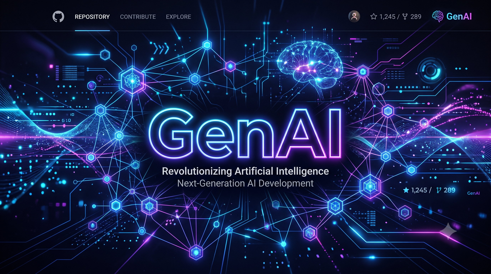
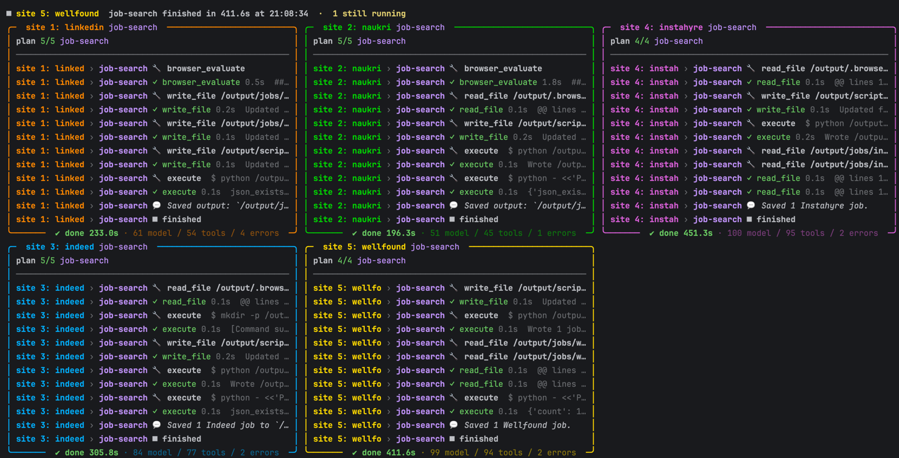
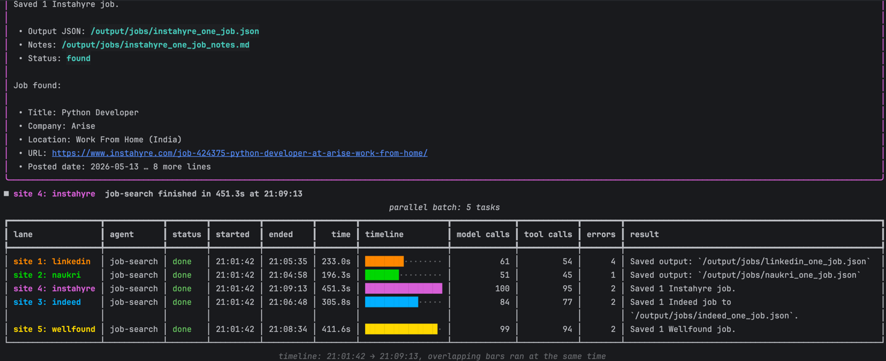
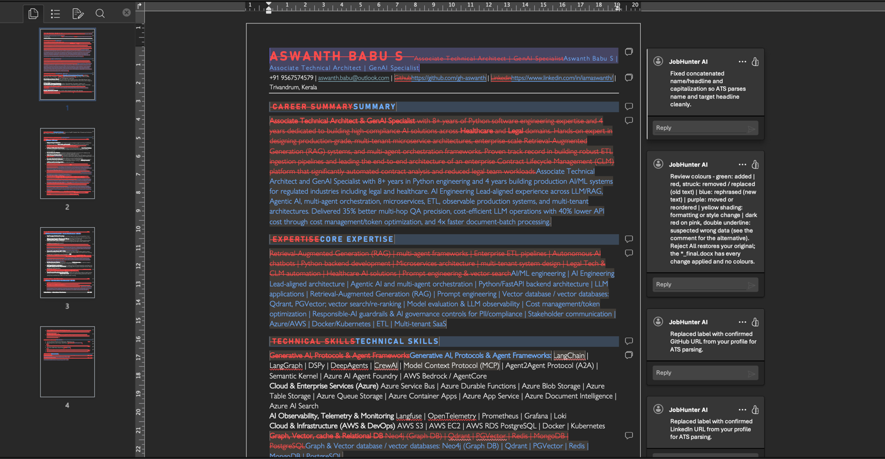

# genai



A monorepo of independent **GenAI workflow projects**, managed as a single
[uv](https://docs.astral.sh/uv/) workspace. Each project lives in its own folder
under `packages/`, has its own `pyproject.toml`, dependencies, tests and README,
and can be installed and run on its own - or all together from the repository
root.

This file is the index for the whole repository: start here, then follow the
link to the project you need.

---

## Project index

| Project | Folder | What it does | Main stack | Entry points | Docs |
|---|---|---|---|---|---|
| **genai-agentic-sandbox** (JobHunter) | [`packages/agentic-sandbox`](packages/agentic-sandbox) | A deep agent that finds jobs with a real browser, scores your resume like an ATS, and writes tailored copies of your `.docx` resume in Word review mode - all file work and code run in a Docker sandbox | LangChain Deep Agents, LangGraph, OpenAI, Playwright MCP, Docker, python-docx | `genai-agentic-sandbox`, `sandbox-build` | [README](packages/agentic-sandbox/README.md) |

<!-- Add one row per new project under packages/ (see "Adding a new project"). -->

Planned workflow projects (not started yet): RAG over Qdrant, multi-agent teams
with AutoGen, prompt optimisation with DSPy, conversation memory with
Redis / Postgres, evals. See [`AGENT.md`](AGENT.md) for the intended set.

---

## Repository layout

```
genai/
├── README.md             ← this index
├── AGENT.md              guidance for AI coding agents working in this repo
├── pyproject.toml        workspace root: member list + shared dev tools
├── uv.lock               ONE lockfile for every project (commit it)
├── .python-version       3.12
├── .env.example          environment variables used by the projects
├── .mcp.json             MCP servers for Claude Code (LangChain + OpenAI docs)
├── .claude/skills/       project skills for Claude Code (Qdrant skills)
├── static/               images used by the READMEs (banner, screenshots)
└── packages/             one folder per project
    └── agentic-sandbox/  genai-agentic-sandbox (JobHunter)
        ├── pyproject.toml
        ├── README.md
        ├── src/genai_agentic_sandbox/
        └── tests/
```

---

## Getting started

### Prerequisites

| Tool | Needed for |
|---|---|
| [uv](https://docs.astral.sh/uv/) | everything (the only package manager used here) |
| Python 3.12 | installed by uv from `.python-version` if missing |
| Docker (Desktop) | projects that run code in a sandbox (agentic-sandbox) |
| Node.js / `npx` | projects that use Playwright MCP (agentic-sandbox) |

### Install

```bash
git clone <repo> genai && cd genai
cp .env.example .env              # fill in the keys you need (OPENAI_API_KEY, ...)

uv sync --all-packages            # every project + shared dev tools
# or only one project:
uv sync --package genai-agentic-sandbox
# or from inside the project folder:
cd packages/agentic-sandbox && uv sync --inexact
```

The workspace shares one `.venv` and one `uv.lock` at the root, so versions stay
consistent across projects. `uv sync` inside a project folder makes the shared
`.venv` match *that* project only; add `--inexact` to keep the others installed,
or run `uv sync --all-packages` at the root to get everything back.

### Run a project

Each project's README has its commands. Workspace-wide:

```bash
uv run --package genai-agentic-sandbox genai-agentic-sandbox --help
```

### Test and lint

```bash
uv run pytest packages/<project>/tests                  # unit tests (default)
uv run pytest -m integration packages/<project>/tests   # also Docker / live services
uv run ruff check packages && uv run ruff format packages
```

Tests that need Docker, a browser or a live service are marked `integration`
and skipped by default (`pyproject.toml` sets `-m 'not integration'`).

---

## Working with the projects

Every folder in `packages/` is a **separate project**:

- **Own dependencies** - declared in its own `pyproject.toml`; the root only
  lists the projects themselves plus shared dev tools.
- **Own code and tests** - `src/<import_name>/` and `tests/`, no imports from
  other projects unless declared as a workspace dependency.
- **Own README** - what it does, how to run it, its configuration.
- **Own outputs** - run outputs stay in the project's output folder and are
  git-ignored.

### Naming

| Item | Convention | Example |
|---|---|---|
| folder | `packages/<name>` | `packages/agentic-sandbox` |
| distribution | `genai-<name>` | `genai-agentic-sandbox` |
| import package | `genai_<name>` | `genai_agentic_sandbox` |
| CLI entry point | `genai-<name>` (optional) | `genai-agentic-sandbox` |

### Adding a new project

```bash
# from the repository root
uv init --lib packages/<name> --name genai-<name>
uv add --package genai-<name> <its dependencies>
uv add genai-<name>                      # register it in the root project
uv sync --all-packages
```

Then:

1. Write `packages/<name>/README.md` (purpose, run, configuration, layout).
2. Add tests in `packages/<name>/tests/` (mark service-dependent ones `integration`).
3. Add its environment variables to `.env.example`.
4. **Add a row to the [Project index](#project-index) and a section under
   [Projects](#projects) below.**

---

## Shared tooling

| File | Purpose |
|---|---|
| [`AGENT.md`](AGENT.md) | Rules for AI coding agents in this repo: uv only, workspace layout, naming, per-project dependencies |
| [`.claude/skills/`](.claude/skills/QDRANT-SKILLS.md) | Vendored [Qdrant skills](https://github.com/qdrant/skills) (Apache-2.0) that Claude Code loads for Qdrant work - sizing, scaling, hybrid search, multitenancy, ... |
| [`.mcp.json`](.mcp.json) | MCP servers for Claude Code: LangChain docs and OpenAI developer docs |
| [`.env.example`](.env.example) | Template for `.env` (never commit `.env`) |
| `pyproject.toml` (root) | Workspace members, shared dev tools (pytest, ruff, mypy), lint and test settings |

---

## Projects

### genai-agentic-sandbox - JobHunter

`packages/agentic-sandbox` - [full README](packages/agentic-sandbox/README.md)

**What:** a job-hunting deep agent. Give it your `.docx` resume and a request;
it finds jobs, picks the best matches, and returns tailored copies of your
resume for each - as colour-coded redlines, Word tracked changes, and a clean
ATS-ready final - improving each round from an independent ATS review.

**How it works:**

| Part | Role |
|---|---|
| orchestrator (main agent) | routes the request to a workflow skill, plans it as a todo list, delegates, verifies, reports |
| `job-search` subagent | finds postings with a real browser (Playwright MCP) |
| `job-matcher` subagent | scores jobs against the resume, picks the best N, writes per-job change lists |
| `job-optimizer` subagent | one per selected job, **all running in parallel**; owns that job's whole loop with its own two subagents: |
| &nbsp;&nbsp;↳ `resume-builder` | writes and runs Python that edits a copy of the resume as tracked changes |
| &nbsp;&nbsp;↳ `ats-reviewer` | scores each version with a fixed script and gives feedback; the loop repeats until the target score |

**See it run:**

Parallel subagents stream live, each in its own window: its plan, every tool
call badged with the lane (`site 1: linkedin › job-search 🔧 …`), and its status,
time and model / tool / error counts. Here, five `job-search` subagents search
five job sites at the same time:



When the last lane finishes, a summary table shows when each one started and
ended, a timeline bar per lane (overlapping bars ran at the same time), and its
model calls, tool calls, errors and result:



The output is your own resume in Word review mode: every edit is a tracked
change, colour-coded (green added, red removed, blue rephrased, ...), with a
comment explaining why it helps the ATS score. Reject All gives back the
original; the `*_final.docx` has every change applied.



**Workflows:** full job hunt - tailor for a job you give (URL or description) -
ATS score only (no edits) - find jobs only - cleanup.

**Key properties:**
- Runs its code in a **Docker sandbox** (no network; sees only the resume copy,
  the output folder and its skills). The browser runs on the host but is
  confined to its captures folder.
- **Your resume is never modified** - it is checked, copied read-only, and
  every change is reversible (Reject All restores the original).
- **Todo discipline** - every agent plans with `write_todos` before working and
  must complete every item before answering; the todo list is the plan.
- **Long-term memory** in `<out>/memories/` (never deleted), **OpenAI prompt
  caching** per agent, cleanup that keeps only the `.docx` deliverables.

**Run:**

```bash
npx @playwright/mcp@latest install-browser chromium    # once
uv run genai-agentic-sandbox --resume ~/cv.docx --out ./jobhunt-output \
  "find senior python backend jobs in Kochi, pick the best 2 and tailor my resume for each"
```

**Other commands:** `uv run sandbox-build` builds and verifies the sandbox image.
Pass `--no-windows` to print parallel lanes as interleaved `[lane › agent]`
lines instead of live windows (the default when output is not a terminal).

<!--
### genai-<name> - <short title>

`packages/<name>` - [full README](packages/<name>/README.md)

**What:** ...
**How it works:** ...
**Run:** ...
-->
